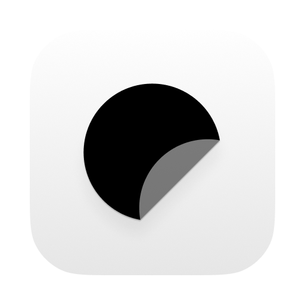
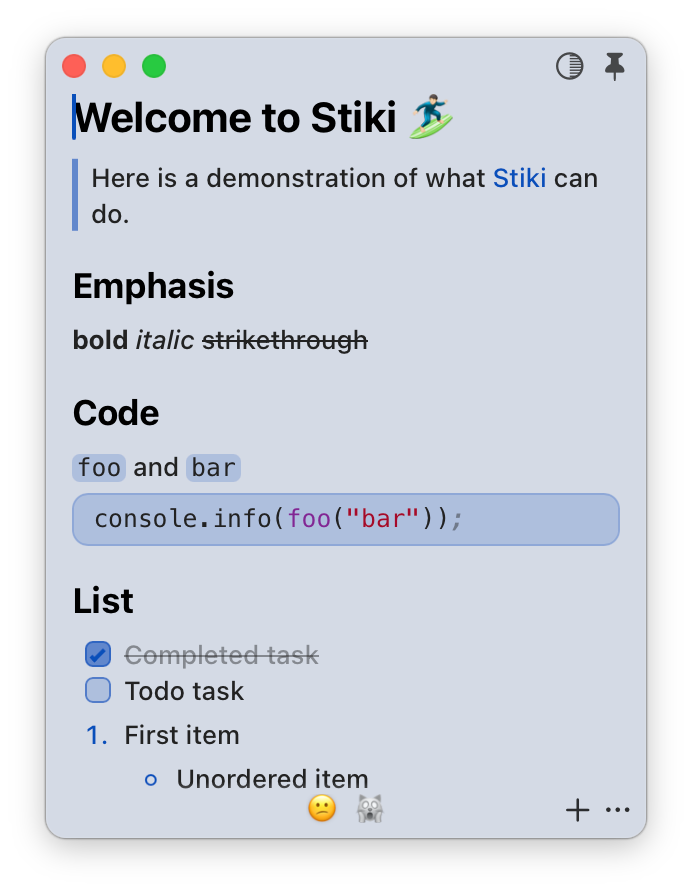
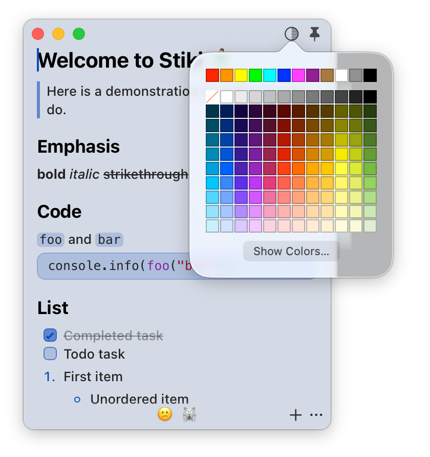
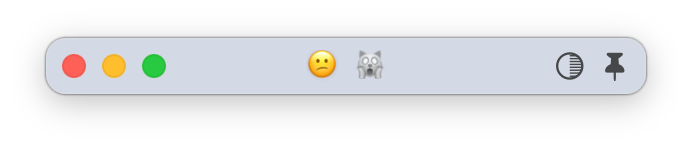

<div align="center">
  <br />
  
  <h1>Stiki</h1>
  <p>Your notes, always close by.<br />
  Keep rich Markdown sticky notes in a compact native macOS window, link tabs to real files, tune the theme, and bring the app back from the tray or a deep link whenever you need it.</p>
  <p>
    <a href="https://github.com/rhinoc/stiki/releases">Releases</a>
    &nbsp;·&nbsp;
    <a href="./LICENSE">License</a>
    &nbsp;·&nbsp;
    <a href="./CREDITS.md">Credits</a>
    &nbsp;·&nbsp;
    <a href="./CONTRIBUTING.md">Contributing</a>
  </p>
  <br />
</div>

## Screenshots

<table>
  <tr>
    <td align="center">
      
      <br />
      <sub>Markdown sticky note</sub>
    </td>
    <td align="center">
      
      <br />
      <sub>Theme color tuning</sub>
    </td>
    <td align="center">
      
      <br />
      <sub>Folded window mode</sub>
    </td>
  </tr>
</table>

## Features

- 📝 **Markdown sticky notes** — Keep quick notes in a compact rich editor with task lists, links, code blocks, images, and clean Markdown output.
- 🔗 **Real files when you want them** — Link a tab to a `.md` or `.markdown` file and let Stiki autosave changes back to disk.
- 🗂️ **A few notes, one small window** — Switch between labeled tabs without turning your desktop into a pile of note windows.
- 📌 **Always within reach** — Pin it above other windows, fold it down, hide it to the tray, or bring it back with `stiki://toggle-window`.
- 🎙️ **Live transcript notes** — Append microphone or system-audio transcript snippets into the current note with Apple Speech by default and optional local SenseVoice models.

## Requirements

- **macOS** for the packaged desktop app and release DMGs.
- **Network access** for release downloads and update checks.
- **Microphone, speech recognition, and system audio permissions** are requested only when transcript capture is used.

## Install

Stiki ships as a macOS disk image. Download the latest **`stiki-<version>-<arch>.dmg`** from **[GitHub Releases](https://github.com/rhinoc/stiki/releases)**.

1. Open the DMG (double-click the download).
2. In the mounted window, drag **`stiki.app`** onto the **Applications** shortcut.
3. Eject the disk image, then launch **Stiki** from **Applications**, Spotlight, or the tray.

The DMG contains `stiki.app` and an **Applications** shortcut only — there is no separate installer or package manager step.

### First launch and Gatekeeper

Browser downloads are tagged with Gatekeeper **quarantine** (`com.apple.quarantine`). If macOS warns that the app cannot be opened or is from an unidentified developer, use one of the options below after copying the app to **Applications**.

Remove quarantine from the installed app:

```bash
xattr -dr com.apple.quarantine /Applications/stiki.app
```

Or **Control-click (or right-click) → Open** on `stiki.app` once and confirm in the dialog. macOS records that exception for future launches.

In-app updates use the same packaged app format. If macOS leaves an updated app outside `/Applications`, drag the updated `stiki.app` into **Applications** the same way.

## Usage

**First launch** creates Stiki's local app state and opens a starter note. App-managed notes and preferences are stored locally; linked Markdown files remain in the file locations you choose.

### Tabs and notes

Use the footer toolbar to add tabs, rename them, assign emoji markers, switch notes, clear content, copy Markdown, or toggle power mode. Each tab keeps its own editor content and label.

### Markdown files

Stiki can link the current tab to a Markdown file. Choose a `.md` or `.markdown` file to open it into the current tab, or save the current tab as a Markdown file and keep it linked for autosave.

Linked tabs show their file path in the tab tooltip. Use the footer toolbar to save immediately or unlink the tab when you want it to return to app-managed storage only.

### Window and tray

Use the header toolbar to pin Stiki above other windows or fold the window down to a smaller height. Closing the window hides it instead of quitting the app.

The tray menu can show or hide the window, toggle launch at startup, check for updates, or quit Stiki.

### Theme tuning

Use the theme control in the header toolbar to adjust the accent color. Stiki stores separate light and dark accent values and follows the system color scheme.

### Transcript capture

Use the microphone button in the footer toolbar to start or stop transcript capture. The transcript source can be microphone audio, system audio, or both. When both sources are enabled, Stiki suppresses close duplicate transcript snippets from different sources so system audio picked up by the microphone is less likely to be written twice.

The transcript backend defaults to **Apple Speech**. Apple Speech uses macOS speech recognition and does not require a local model folder.

The footer toolbar menu includes transcript settings for source, language, backend, local SenseVoice model, and output format. Transcript format can include or omit a 24-hour timestamp and speaker prefix. When speaker is enabled, snippets are written with `Mic:` or `System:`.

#### Local SenseVoice models

SenseVoice models are user-provided. Stiki release builds include the local inference runtime, but model files are not bundled or committed to this repository. Users can keep large model directories wherever they prefer.

To add a local SenseVoice model:

1. Open the footer toolbar menu.
2. Choose **Backend: SenseVoice**.
3. Choose **SenseVoice Model → Open Models Folder...**.
4. Put a model directory in that folder, or create a symbolic link to a model directory stored elsewhere.
5. Choose **SenseVoice Model → Refresh Models**.
6. Select the model from the **SenseVoice Model** submenu.

The models folder is:

```text
~/Library/Application Support/com.rhinoc.stiki/sensevoice-models/
```

Each direct child directory or symbolic link is treated as one selectable model. For example:

```bash
ln -s ~/.cache/modelscope/hub/models/iic/SenseVoiceSmall \
  ~/Library/Application\ Support/com.rhinoc.stiki/sensevoice-models/SenseVoiceSmall
```

Different model sizes, checkpoints, or parameter variants can be exposed by adding more directories or links with different names. Stiki lists direct child directories and symlinks, but the SenseVoice/FunASR loader still requires a valid model layout at runtime.

### Deep links

Use this URL to toggle the main window from launchers or scripts:

```text
stiki://toggle-window
```

### Local data locations

| Location | What it stores | Notes |
| --- | --- | --- |
| `~/Library/Application Support/com.rhinoc.stiki/` | App-managed settings and note state | Includes the Tauri store data used by Stiki. |
| `~/Library/Application Support/com.rhinoc.stiki/sensevoice-models/` | User-provided SenseVoice model directories or symlinks | Model files are not committed to this repository. |
| User-selected `.md` / `.markdown` files | Linked note content | Stiki writes linked tabs back to these files. |

## Contributing

For development setup, coding conventions, tests, asset rules, and release boundaries, read **[CONTRIBUTING.md](./CONTRIBUTING.md)**.

## Third-Party Assets and Licenses

Original project source code is licensed under the **MIT License**. See **[LICENSE](./LICENSE)**.

That license does not override third-party terms. This repository includes or references frameworks, packages, icons, release tools, and platform integrations with separate licenses or usage terms. See **[CREDITS.md](./CREDITS.md)** for attribution and current redistribution notes.

**Important boundaries:**

- Tauri, Svelte, Tiptap, ProseMirror, and other dependencies remain under their own upstream licenses.
- Bundled icons and DMG background assets require source-by-source redistribution verification before replacement or reuse outside this project.
- Release DMGs, updater archives, signing keys, certificates, passwords, and notarization credentials are not source artifacts and should not be committed.
